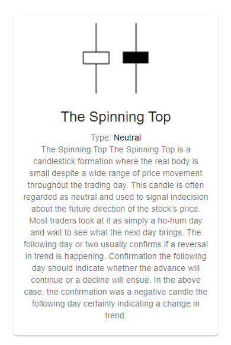
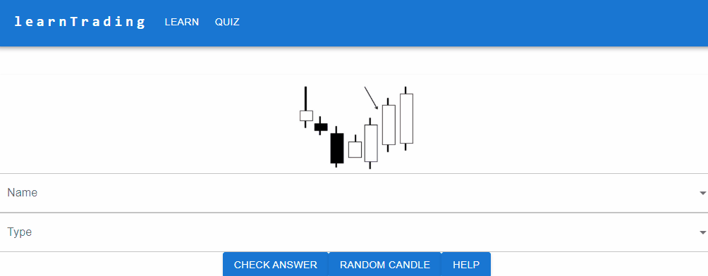
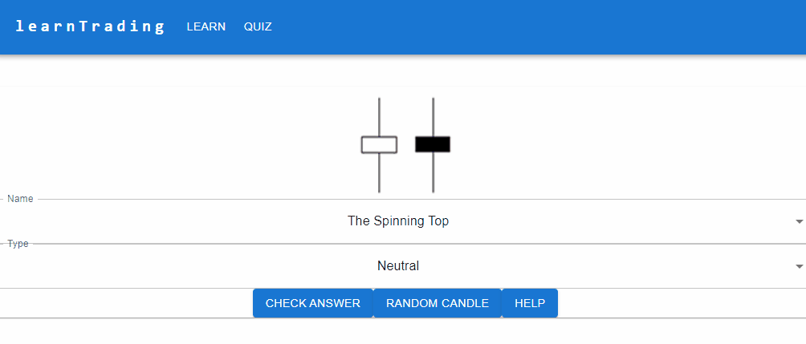
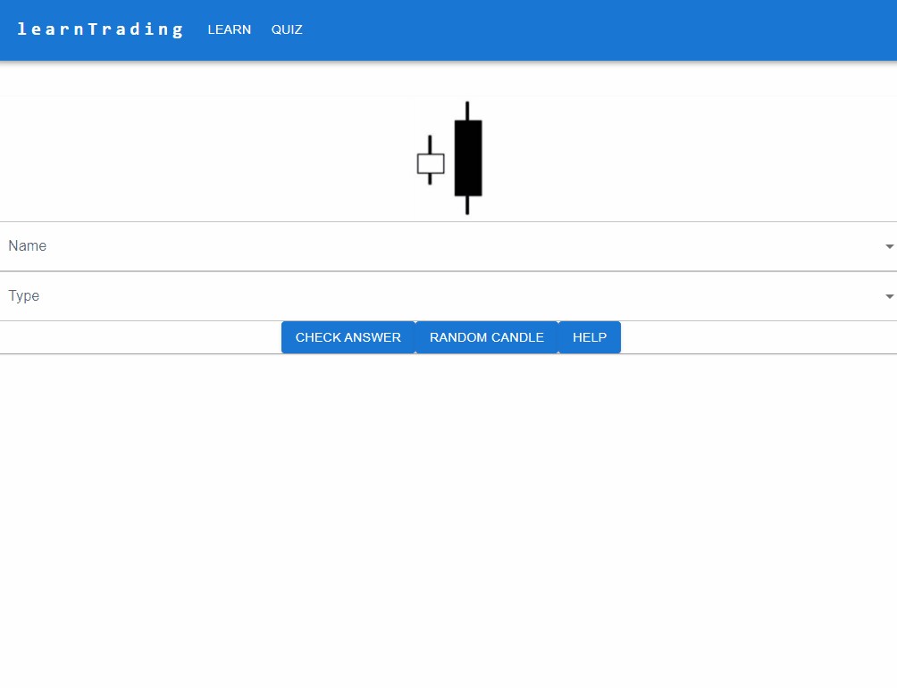

<a name="readme-top"></a>
<!-- PROJECT LOGO -->
<br />
<div align="center">
  <a href="https://github.com/jaxondinh/learnTrading">
    
  </a>

<h3 align="center">learnTrading</h3>

  <p align="center">
    A Candle Pattern Learning Tool
    <br />
    <br />
    <br />
  </p>
</div>


<!-- TABLE OF CONTENTS -->
<details>
  <summary>Table of Contents</summary>
  <ol>
    <li>
      <a href="#about-the-project">About The Project</a>
      <ul>
        <li><a href="#built-with">Built With</a></li>
      </ul>
    </li>
    <li>
      <a href="#getting-started">Getting Started</a>
      <ul>
        <li><a href="#prerequisites">Prerequisites</a></li>
        <li><a href="#installation">Installation</a></li>
      </ul>
    </li>
    <li><a href="#usage">Usage</a></li>
    <li><a href="#license">License</a></li>
  </ol>
</details>


<!-- ABOUT THE PROJECT -->
## About The Project
learnTrading is a React App created to display the candle pattern information taken from Charting and Technical Analysis by Fred McAllen. It was created to help a friend learn the candle patterns in a flashcard like format, which allowed for easier memorization whilst also being able to learn the content in a fun manner.

### Built With
* [![React][React.js]][React-url]

<!-- GETTING STARTED -->
## Getting Started
To get a local copy up and running follow these simple example steps.

### Prerequisites
This project requires npm, instructions can be found:
https://docs.npmjs.com/downloading-and-installing-node-js-and-npm

### Installation
1. Clone the repo
   ```sh
   git clone https://github.com/jaxondinh/learnTrading.git
   ```
2. Install NPM packages
   ```sh
   npm install
   ```
3. Run the project
   ```sh
   npm start
   ```

<!-- USAGE EXAMPLES -->
## Usage
learnTrading was made to be used in two different manners:
1. To present each candle pattern within a display card with its name, description and type.


2. To have a flashcard like functionto help learn and memorize patterns, with feature such as random candle, answer check and help.





<!-- LICENSE -->
## License

Distributed under the MIT License. See `LICENSE.txt` for more information.

<p align="right">(<a href="#readme-top">back to top</a>)</p>


[React.js]: https://img.shields.io/badge/React-20232A?style=for-the-badge&logo=react&logoColor=61DAFB
[React-url]: https://reactjs.org/
